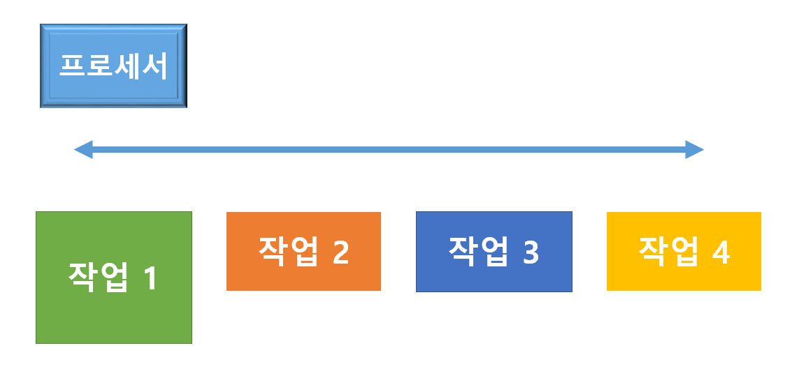
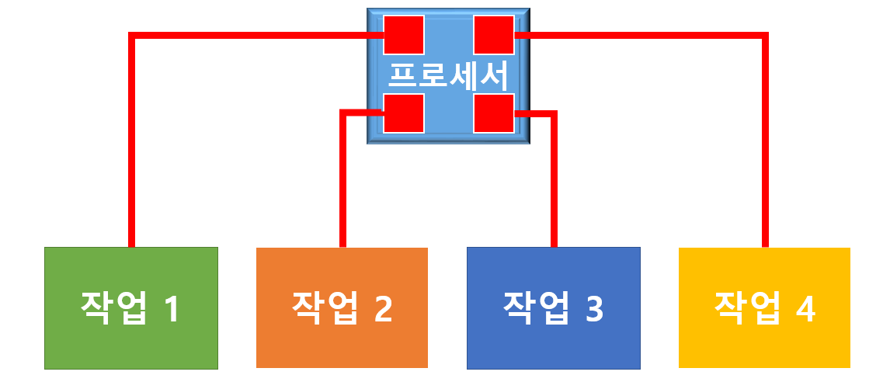

# 프로세스와 스레드


- 게임을 다운로드 하는 작업
- 마우스나 키보드로 입력 받는 작업
- 브라우저로 웹서핑을 하는 작업

등등


다음과 같은 작업을 동시에 하지 못했던 예전 컴퓨터 시절이 있었다.

컴퓨터가 프로세스 여러개를 함께 돌리는 멀티태스킹이 가능해진 오늘날 여러 작업을 동시에 할 수 있게 되었다. 


윈도우 기준으로 .exe 가 붙어있는 파일들을 "프로그램" 이라고 한다. 

그 프로그램이 컴퓨터 상에서 돌아가고 있는 상태를 **프로세스** 라고 한다. 


오늘날 여러 작업을 동시에 할 수 있게 된 것은 운영체제에서 여러 프로세스를 동시에 돌릴 수 있게 되었기 때문이다. 

> 윈도우의 작업관리자에서 컴퓨터의 동시에 돌아가는 여러 프로세스를 확인 할 수 있다. 


### 여러 프로세스가 돌아가는 방식은 동시성, 병렬적 혹은 둘의 혼합으로 이루어 진다. 


## 동시성



- 프로세서 하나가 여러 작업을 Context Switching 하며 수행하는 방식
- 다양한 방식과 알고리즘으로 구성된 방법이다.
- 엄청 빨리 돌아가므로 사용자는 동시적으로 수행되는 것처럼 느껴진다.


## 병렬성



- 프로세서 하나에 코어 여러개가 달려서 각각 동시에 작업들을 수행하는 것이다. 
- 듀얼코어(x2), 쿼드코어(x4), 옥타코어(x8) 라는 명칭이 붙는 멀티코어 프로세서가 달린 컴퓨터 방식이다. 
- CPU 의 발전이 발열 등의 문제로 인하여 이전만큼 빨리 발전하지 못해 대안으로 코어 여러개로 작업을 분담하는 방식이다. 


> 뭐 멀티작업을 가능하게 하는 것이 위와 같은 방식이라는 건 알겠다
>
> 그럼 스레드 Thread 는 무엇인가?

- 브라우저가 하나의 프로세스라고 한다면
  - 게임 다운로드
  - youtube 영상받기
  - youtube 영상실행
  - 웹서핑

- 다음과 같은 작업을 동시에 진행해야한다. 

> 한 프로세스 안에서 여러 갈래 작업들이 동시에 진행되어야 한다. 
>
> 이 갈래를 '스레드' 라고 한다


## 자원 공유

컴퓨터는 프로세스마다 자원을 분할해서 사용한다. 

단. 스레드는 프로세스마다 주어진 자원을 분할 해서 사용한다. 

- 그러다 보니 스레드가 동시에 자원을 공유하기에 특정 변수의 수치가 맞지 않는 경우가 발생하게 된다. 


## 예제코드

```java
package com.company.Thread;

public class RamenProgram {

    public static void main(String[] args) {

        try {
            RamenCook ramenCook = new RamenCook(Integer.parseInt(args[0]));
            new Thread(ramenCook, "A").start();
            new Thread(ramenCook, "B").start();
            new Thread(ramenCook, "C").start();
            new Thread(ramenCook, "D").start();
        } catch (Exception e) {
            e.printStackTrace();
        }
    }


}

class RamenCook implements Runnable {

    private int ramenCount;
    private String[] burners = {"_", "_", "_", "_"};

    public RamenCook(int count) {
        this.ramenCount = count;
    }

    @Override
    public void run() {
        while (ramenCount > 0) {

            synchronized (this) {
                ramenCount--;
                System.out.println(
                        Thread.currentThread().getName()
                        +": " + ramenCount + "개 남음"
                );
            }

            for (int i = 0; i < burners.length; i++) {
                if (!burners[i].equals("_")) continue;

                synchronized (this) {
                    burners[i] = Thread.currentThread().getName();
                    System.out.println(
                            "                 "
                            + Thread.currentThread().getName()
                            + ": [" + (i + 1) + "]번 버너 ON"
                    );
                    showBurners();
                }

                try {
                    Thread.sleep(2000);
                } catch (InterruptedException e) {
                    e.printStackTrace();
                }

                synchronized (this) {
                    burners[i] = "_";
                    System.out.println(
                            "                                  "
                            + Thread.currentThread().getName()
                            + ": [" + (i + 1) + "]번 버너 OFF"
                    );
                    showBurners();
                }
                break;
            }

            try {
                Thread.sleep(Math.round(1000 * Math.random()));
            } catch (InterruptedException e) {
                e.printStackTrace();
            }

        }
    }

    private void showBurners() {
        String stringToPrint = "";
        for (int i = 0; i < burners.length; i++) {
            stringToPrint += (" " + burners[i]);
        }
        System.out.println(stringToPrint);
    }
}
```

main 메소드와 RamenCook 이라는 클래스를 나누었다. 

RamenCook은 Runnable 이란 인터페이스를 사용한다. 

스레드에서 진행할 작업을 run 이라는 메소드에서 사용하기 위해 정의한다는 뜻이다. 

showBurners 메소드는 버너의 상태를 나타내기 위한 메소드이다.

synchronized 는 스레드가 자원을 동시에 접근하지 못하게 하기 위한 블럭이다.  

라면이 끓고 다음라면을 끓이기 까지 0 ~ 1 초 랜덤으로 대기한다

각 쓰레드의 이름은 A, B, C, D 라고 정의한다.


### 컴파일 후 실행

``` 
javac RamenProgram.java
java RamenProgram 50
```


