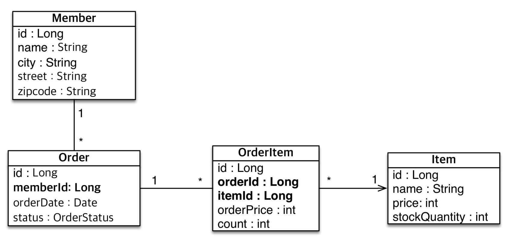

# 엔티티 매핑

## 객체와 테이블 매핑


- @Entity

JPA 가 관리하는 엔티티 라고 한다. 

JPA를 사용해서 테이블과 매핑할 때는 @Entity 필수이다.

> 주의
>
> - 기본생성자 필수 (public protected)
> - final클래스, enum, interface, inner 클래스 사용 X
> - 저장할 필드에 final 사용 X

```java
@Entity
public class Member {

    @Id // primary key 라고 인식시켜줌
    private Long id;
    private String name;

    public Long getId() {
        return id;
    }

    public void setId(Long id) {
        this.id = id;
    }

    public String getName() {
        return name;
    }

    public void setName(String name) {
        this.name = name;
    }
}
```

<br/>

- 만약 Table 이름을 직접 매핑해야한다면 다음과 같이 코드를 작성한다.

```java
@Entity
@Table(name = "MBR")
public class Member {
     ...
}
```


다음은 jpa 의 기능이다.

### 데이터베이스 스키마 자동 생성 기능

- DDL을 애플리케이션 실행 시점에 자동 생성
- 테이블 중심 -> 객체 중심
- 데이터베이스 방언을 활용해서 데이터베이스에 맞는 적절한 DDL 생성 (설정은 persistence.xml)
- 이렇게 생성된 DDL은 개발 장비에서만 사용해야한다.

> 즉 @Entity 로 지정된 클래스는 애플리케이션을 구동할 때 JPA 가 알아서 DDL 을 전달해 DB에 테이블을 생성할 수 있다는 것이다.


### 데이터베이스 스키마 자동 생성 - 속성

```xml
<property name="hibernate.hbm2ddl.auto" value="create" />
```

| 옵션        | 설명                                         |
| ----------- | -------------------------------------------- |
| create      | 기존테이블 삭제 후 다시 생성 (DROP + CREATE) |
| create-drop | create와 같으나 종료시점에 테이블 DROP       |
| update      | 변경분만 반영(운영DB에는 사용 안됨)          |
| validate    | 엔티티와 테이블이 정상 매핑되었는지만 확인   |
| none        | 사용하지 않음                                |

- update 에서 컬럼 삭제는 반영되지 않는다.
- 각 옵션에 따른 sql 문은 운영 DB에 맞추어 변경된다.
- **!!! 운영 장비에는 절대 create, create-drop, update 를 사용하면 안된다!!!!**

> 개발 초기 단계는 create 또는 update
>
> 테스트 서버는 update 또는 validate (공동 개발 작업 -> 이것도 왠만하면 사용하지 말라!!)
>
> 스테이징과 운영 서버는 validate 또는 none


### DDL 생성 기능

```java
@Column(unique = true, length = 10)
private String name;
```

- @Column 어노테이션으로 테이블 컬럼의 조건을 제시할 수 있다.
- 위 스키마 자동 속성으로 적용이 가능하다


## 필드와 컬럼 매핑

vo의 맴버변수와 테이블 컬럼간의 매핑을 어노테이션을 통해서 할 수 있다. 

```java
@Id
private Long id;

@Column(unique = true, length = 10)
private String name;

private Integer age;

@Enumerated(EnumType.STRING)
private RoleType roleType;

@Temporal(TemporalType.TIMESTAMP)
private Date createdDate;

@Temporal(TemporalType.TIMESTAMP)
private Date lastModifiedDate;

@Lob
private String description;
```

| 어노테이션  | 설명                                         |
| ----------- | -------------------------------------------- |
| @Column     | 컬럼 매핑                                    |
| @Temporal   | 날짜 타입 매핑                               |
| @Enumerated | enum 타입 매핑                               |
| @Lob        | BLOB, CLOB 매핑                              |
| @Transient  | 특정 필드를 컬럼에 매핑하지 않음 (매핑 무시) |

- @Column

- @Temporal

보통 DataBase 에서는 DATE, TIME, TIMESTAMP 3가지 종류가 있다.

- @Transient

해당 필드를 메모리에서만 사용하기 위해 사용하는 어노테이션이다.

- @Enumerated

EnumType.String 으로 해당 변수를 매핑하면 varchar255 로 테이블 컬럼이 매핑이 된다. (enum 의 문자 그대로 들어간다)

EnumType.ORDINAL 은 사용하지 않는다. enum 클래스에 enum을 추가할때 기존 데이터와 순서가 맞지 않게 된다.

- @Temporal

날짜 타입 (java.util.Date, java.util.Calendar)을 매핑할 때 사용

LocalDate, LocalDateTime 을 사용할 때는 생략이 가능하다

- @Lob 은 지정할 수 있는 속성이 없다. 

매핑하는 필드 타입이 문자면 CLOB 매핑, 나머지는 BLOB 매핑을 한다.

CLOB: String, char[], java.sql.CLOB 

BLOB: byte[], java.sql. BLOB


## 기본 키 매핑

기본 키 매핑 방법

- 직접 할당: @Id만 사용

- 자동 생성: @GeneratedValue 를 사용해야 하며 각 전략에 따라 기본키의 매핑이 이루어진다.

  - IDENTITY: 데이터베이스에 위임하여 id값을 할당한다.

    - ```java
      @Entity 
      public class Member { 
       	@Id 
       	@GeneratedValue(strategy = GenerationType.IDENTITY) 
       	private Long id; 
      ```

  - SEQUENCE: 데이터베이스 시퀀스 오브젝트를 사용하여 오브젝트를 가져온다. 

    - ```java
      @Entity 
      @SequenceGenerator( 
       	name = “MEMBER_SEQ_GENERATOR", 
       	sequenceName = “MEMBER_SEQ", //매핑할 데이터베이스 시퀀스 이름
       	initialValue = 1, allocationSize = 1) 
      public class Member { 
       	@Id 
       	@GeneratedValue(strategy = GenerationType.SEQUENCE, 
       		generator = "MEMBER_SEQ_GENERATOR") 
       	private Long id; 
      ```

  - TABLE: 키 생성용 테이블 사용, 모든 DB 에서 사용 @TableGenerator 필요

    - ```java
      create table MY_SEQUENCES ( 
       	sequence_name varchar(255) not null, 
       	next_val bigint, 
       	primary key ( sequence_name ) 
      )
      ```

    - ```java
      @Entity
      @TableGenerator(
              name = "MEMBER_SEQ_GENERATOR",
              table = "MY_SEQUENCES",
              pkColumnValue = “MEMBER_SEQ", allocationSize = 1) 
      public class Member {
      @Id
      @GeneratedValue(strategy = GenerationType.TABLE,
              generator = "MEMBER_SEQ_GENERATOR")
      private Long id;
      ```

  - AUTO: 방언에 따라 자동 지정, 기본 값 

  

  > 권장하는 식별자 전략으로는
  >
  > Long형 + 대체키 + 키 생성전략 사용
  >
  > 을 추천한다.


### 실전 예제 

> 연관관계 매핑에 들어가기 전에 데이터 중심의 설계의 문제점을 실전 예제를 살펴본다
>
> 추가로 데이터 중심 설계의 문제점을 살펴본다.




- Order N : 1 Member 관계인 두가지 테이블을 다음과 같이 객체로 만들 수 있다.

```java
public class Order {

    @Id
    @GeneratedValue
    @Column(name="ORDER_ID")
    private Long id;

    @Column(name="MEMBER_ID")
    private Long memberId;

    private Member member;
    ... 생략
```


```java
public class Member {

    @Id @GeneratedValue
    @Column(name = "MEMBER_ID")
    private Long id;
    private String name;
    private String city;
    private String street;
    private String zipcode;
```


- Order 테이블에서 Member Id 로 Member 테이블에서 데이터를 가져오려면 다음과 같다.

```java
// SELECT * FROM ORDER WHERE id = 1;
Order order = em.find(Order.class, 1L);
Long memberId = order.getMemberId();

// SELECT * FROM MEMBER WHERE memberid = 1;
Member member = em.find(Member.class, memberId);

Member findMember = order.getMember();
```

- 데이터 중심 설계의 문제점은 다음과 같다.
  - 테이블의 외래키를 객체에 그대로 가져온다.
  - 객체 그래프 탐색이 불가능하다.
  - 참조가 없으므로 UML도 잘못되었다.
- 따라서 다음 연관관계 매핑으로 Order 데이터를 가져올때 Member 를 같이 가져오게 해야한다.


<br>

## 연관관계 매핑

