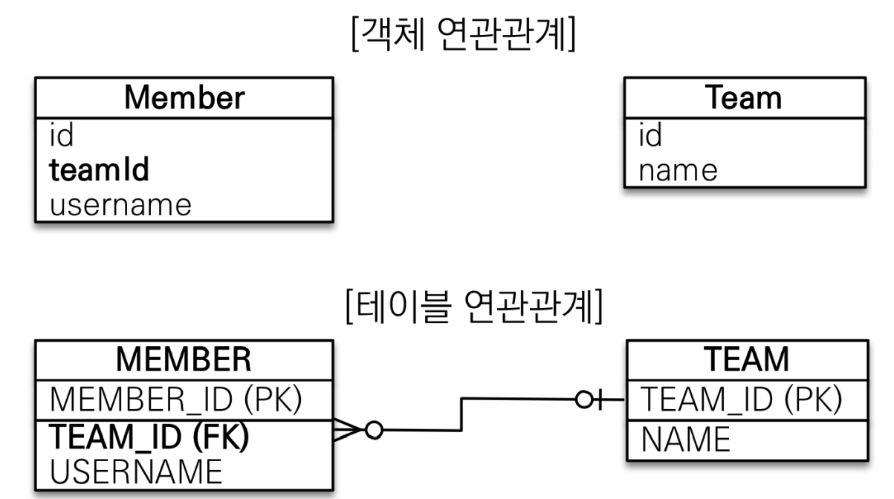
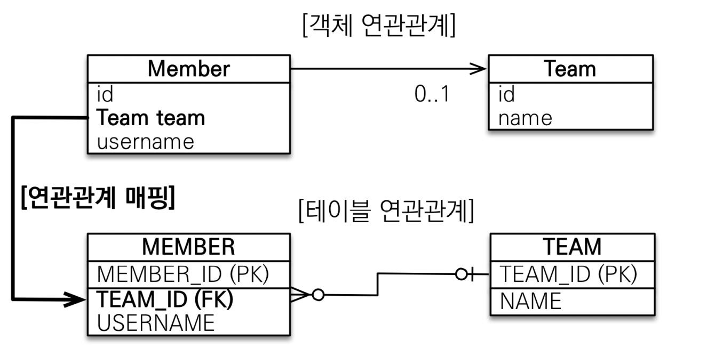
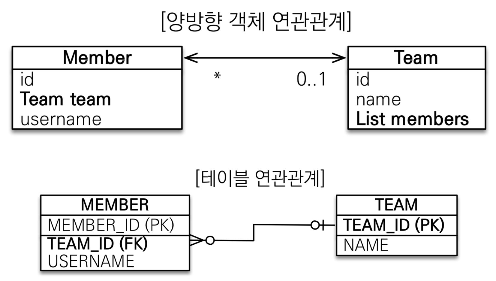
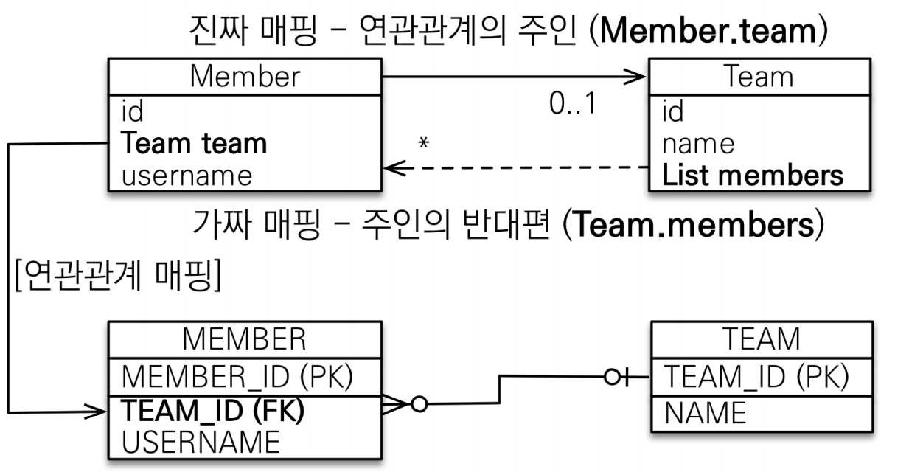

# 연관관계 매핑 기초

## 객체와 테이블 연관 관계 차이

용어

- 당향 : 단방향, 양방향
- 다중성 : 다대일, 일대다, 일대일
- 연관관계의 주인 : 객체 양방향 연관관계는 관리

<br/>

## 연관관계가 필요한 이유

- 연관관계가 없는 객체





```java
@Entity
public class Member {

    @Id @GeneratedValue
    @Column(name = "MEMBER_ID")
    private Long id;

    @Column(name = "USERNAME")
    private String username;

    @Column(name = "TEAM_ID")
    private Long teamId;
    
    ... 생략
```

```java
@Entity
public class Team {

    @Id
    @GeneratedValue
    @Column(name = "TEAM_ID")
    private Long id;
    private String name;
    
    ... 생략
```


다음 두 객체를 가지고 데이터 중심의 모델링을 한 코드이다.

```java
// 저장
Team team = new Team();
team.setName("TeamA");
em.persist(team);

Member member = new Member();
member.setUsername("member1");
member.setTeamId(team.getId());
em.persist(member);

// 조회
Member findMember = em.find(Member.class, member.getId());

Long findTeamId = findMember.getTeamId();
Team findTeam = em.find(Team.class, findTeamId);

tx.commit();
```

- Team 테이블의 데이터를 조회 하기 위해서 Member 테이블의 쿼리를 조회하고 다시 Team 테이블을 조회하는 방식은 객체지향적이지 않다.

<br/>

## 단방향 연관관계

### 객체 연관관계 사용 -연관관계 저장, 연관관계 조회(객체 그래프 탐색)




```java
@Entity
public class Member {

    @Id @GeneratedValue
    @Column(name = "MEMBER_ID")
    private Long id;

    @Column(name = "USERNAME")
    private String username;

//    @Column(name = "TEAM_ID")
//    private Long teamId;

    @ManyToOne // 관계
    @JoinColumn(name = "TEAM_ID") // FK
    private Team team;
```

```java
@Entity
public class Team {

    @Id
    @GeneratedValue
    @Column(name = "TEAM_ID")
    private Long id;
    private String name;
```

```java
// 저장
Team team = new Team();
team.setName("TeamA");
em.persist(team);

Member member = new Member();
member.setUsername("member1");
member.setTeam(team); //jpa 가 PK 값을 꺼내서 Team 에 넣어준다
em.persist(member);

// 조회
Member findMember = em.find(Member.class, member.getId());

Team findTeam = findMember.getTeam();
System.out.println("findTeam = " + findTeam.getName());

tx.commit();
```

- em.persist(member) 시점에서 영속성 컨텍스트에 담긴다.

- em.find(Member.class, member.getId()); 영속성 컨텍스트에 Member 가 있기에 1차 캐시에서 데이터를 가져온다.

  - 만일 1차 캐시에서 데이터를 가져오는 것이 아니라 DB에서 데이터를 가져오고 싶다 하면 다음 코드를 추가한다.

  - ```java
    ...
    em.persist(member);
    
    em.flush(); // 영속성 컨텍스트 날리고
    em.clear(); // 초기화
    
    // 조회
    Member findMember = em.find(Member.class, member.getId());
    ...
    ```

- 결론
  
  - jpa 에서는 객체지향스러운 코드를 객체지향과 DB에 외래키를 매핑해서 연관관계 매핑을 할 수 있다


### 연관관계 수정

```java
// 기존 연관관계
Member findMember = em.find(Member.class, member.getId());
Team findTeam = findMember.getTeam();

// 새로운 연관관계
Team newTeam = em.find(Team.class, 100L);
findMember.setTeam(newTeam);
```

- 기존의 연관관계를 수정하는 방법은 간단하다.

<br/>

## 양방향 연관관계

> 양방향 연관관계와 연관 관계 주인



- 단방향 연관관계에서 Member 테이블에서 Team 을 가져오는 것을 확인했다.
- 반대로 Team 에서 Member 테이블의 정보를 가져올 때 양방향 연관관계가 필요하다.
  - 회원 -> 팀 (Member.team)
  - 팀 -> 회원 (Team.members)

- 테이블 연관관계는 단방향 연관관계와 동일하다.

> FK 하나로 양방향의 연관관계를 맺을 수 있다는 것이 중요하다!


- Member 테이블

```java
@Entity
public class Member {

    @Id @GeneratedValue
    @Column(name = "MEMBER_ID")
    private Long id;

    @Column(name = "USERNAME")
    private String username;

    @ManyToOne // 관계
    @JoinColumn(name = "TEAM_ID") // FK
    private Team team;
    
    ... 생략
}
```

> Member 테이블은 단방향 연관관계와 동일하다.


- Team 테이블

```java
@Entity
public class Team {

    @Id
    @GeneratedValue
    @Column(name = "TEAM_ID")
    private Long id;
    private String name;

    @OneToMany(mappedBy = "team")
    private List<Member> members = new ArrayList<>(); // null 방지 코드 (관례)
    
    ... 생략
}
```

> Team 테이블에서 members 라는 맴버변수가 생겼다. 
>
> Member class 의 team 맴버변수와 반대로 @OneToMany 로 명시한다.
>
> new ArrayList<>(); 는 null 방지 코드로 관례라고 한다.


- 실행 코드

```java
// 저장
Team team = new Team();
team.setName("TeamA");
em.persist(team);

Member member = new Member();
member.setUsername("member1");
member.setTeam(team); //jpa 가 PK 값을 꺼내서 Team 에 넣어준다
em.persist(member);

em.flush();
em.clear();

// 조회
Member findMember = em.find(Member.class, member.getId());
List<Member> members = findMember.getTeam().getMembers(); // 양방향 연관관계

for (Member m : members) {
	System.out.println("m = " + m.getUsername());
}
```

<br/>

### 연관관계의 주인과 mappedBy

- 객체와 테이블이 관계를 맺는 차이를 이해해야 한다. 

객체는 단방향 연관관계가 2개 이다.

회원 -> 팀 연관관계 1개 (단방향)

팀 -> 회원 연관관계 1개 (단방향)


테이블은 양방향 연관관계가 1개 이다.

회원 <-> 팀 연관관계 1개 (양방향)


- 테이블 입장에서 외래키를 업데이트를 해야할 때 어떤 객체를 기준으로 왜래키를 관리하는지에 대한 고민이 생긴다. 두개의 객체 모두 서로의 정보를 가지고 있는 상황에서 어느 하나로 지정해서 (주인) 관리를 하는 개념이 생긴다.

- 이러한 차이로 인해 연관관계의 주인이라는 개념이 필요하다. 


- 연관관계의 주인 Owner

  - 외래키 관리 주체 (등록, 수정)

  - 주인이 아닌쪽은 읽기만 가능

  - 주인은 mappedBy 속성 사용 X

  - 주인이 아니면 mappedBy 속성으로 주인 지정

    

- **주인은 Forien Key 가 있는 테이블을 기준으로 선택한다!**

  

> Member 객체의 데이터 를 수정할때 Member 테이블의 정보가 관리되는 것이 가장 합리적이다!