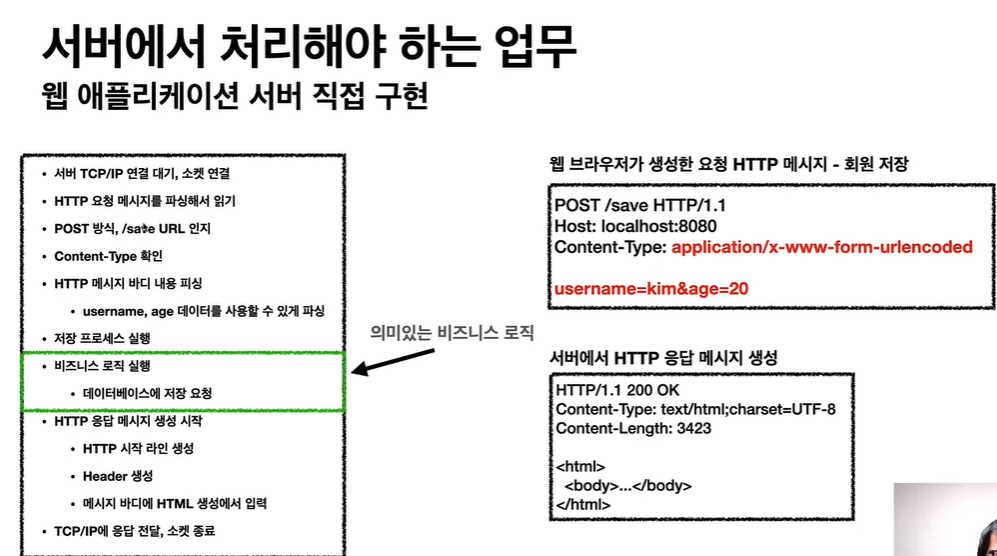
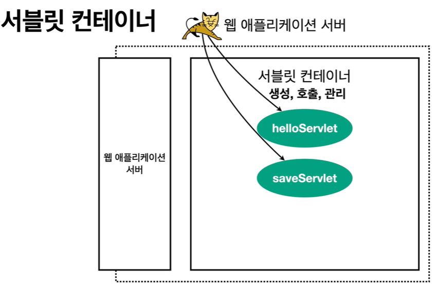
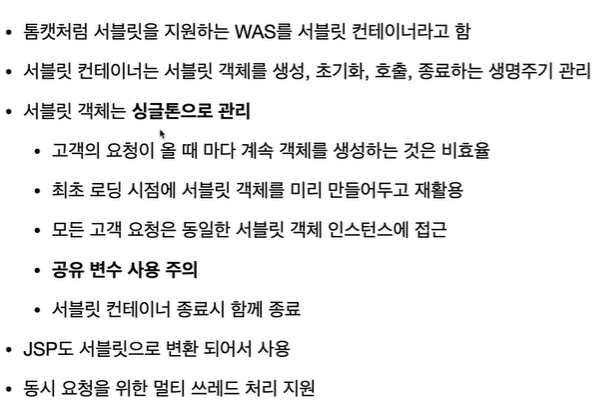

# 서블릿

서버에서 처리해야할 업무

### 서블릿은!

**의미있는 비즈니스 로직을 제외하고 모든 과정을 처리해준다!!!**

### 특징

- urlPatterns(/hello) 의 url 이 호출되면 서블릿 코드가 실행
- HTTP 요청 정보를 편리하게 사용할 수 있는 HttpServletRequest
- HTTP 응답 정보를 편리하게 사용할 수 있는 HttpServletResponse
- 개발자는 HTTP 스펙을 매우 편리하게 사용

### 서블릿 컨테이너

- 특징

