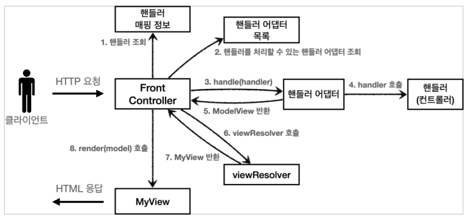

# 스프링 MVC 1편 - MVC 프레임워크 만들기

## 프론트 컨트롤러 패턴

- Before


- After


- FrontController 패턴 특징
  - 프론트 컨트롤러 서블릿 하나로 클라이언트의 요청을 받음 
  - 프론트 컨트롤러가 요청에 맞는 컨트롤러를 찾아서 호출 
  - 입구를 하나로! 
  - 공통 처리 가능 프론트 컨트롤러를 제외한 나머지 컨트롤러는 서블릿을 사용하지 않아도 됨


<br/>

**스프링 웹 MVC와 프론트 컨트롤러** 

**스프링 웹 MVC의 핵심도 바로 FrontController** 

**스프링 웹 MVC의 DispatcherServlet이 FrontController 패턴으로 구현되어 있음**

<br/>


## 프론트 컨트롤러 - v1


### 바뀐점

- 컨트롤러용 인터페이스

```java
import javax.servlet.ServletException;
import javax.servlet.http.HttpServletRequest;
import javax.servlet.http.HttpServletResponse;
import java.io.IOException;

public interface ControllerV1 {

    void process(HttpServletRequest request, HttpServletResponse response) throws ServletException, IOException;
}

```

```java
import hello.servlet.web.frontcontroller.v1.controller.MemberFormControllerV1;
import hello.servlet.web.frontcontroller.v1.controller.MemberListControllerV1;
import hello.servlet.web.frontcontroller.v1.controller.MemberSaveControllerV1;

import javax.servlet.ServletException;
import javax.servlet.annotation.WebServlet;
import javax.servlet.http.HttpServlet;
import javax.servlet.http.HttpServletRequest;
import javax.servlet.http.HttpServletResponse;
import java.io.IOException;
import java.util.HashMap;
import java.util.Map;

@WebServlet(name = "frontControllerServletV1", urlPatterns = "/front-controller/v1/*")
public class FrontControllerServletV1 extends HttpServlet {

    private Map<String, ControllerV1> controllerMap = new HashMap<>();

    public FrontControllerServletV1() {
        controllerMap.put("/front-controller/v1/members/new-form", new MemberFormControllerV1());
        controllerMap.put("/front-controller/v1/members/save", new MemberSaveControllerV1());
        controllerMap.put("/front-controller/v1/members", new MemberListControllerV1());
    }

    @Override
    protected void service(HttpServletRequest request, HttpServletResponse response) throws ServletException, IOException {
        System.out.println("FrontControllerServletV1.service");

        String requestURI = request.getRequestURI();

        ControllerV1 controller = controllerMap.get(requestURI);
        // 예외 처리
        if (controller == null) {
            response.setStatus(HttpServletResponse.SC_NOT_FOUND);
            return;
        }

        // 다형성의 이점 부분!
        controller.process(request, response);
    }
}
```

- urlPatterns
  - urlPatterns = "/front-controller/v1/*" : /front-controller/v1 를 포함한 하위 모든 요청은 이 서블릿에서 받아들인다.
  - 예) /front-controller/v1 , /front-controller/v1/a , /front-controller/v1/a/b
- controllerMap
  - key: 매핑 URL 
  - value: 호출될 컨트롤러
- service()
  - 먼저 requestURI 를 조회해서 실제 호출할 컨트롤러를 controllerMap 에서 찾는다. 만약 없다면 404(SC_NOT_FOUND) 상태 코드를 반환한다. 
  - 컨트롤러를 찾고 controller.process(request, response); 을 호출해서 해당 컨트롤러를 실행한다.
- jsp
  - jsp 사용


<br/>

<br/>

## 프론트 컨트롤러 - v2


 ### 바뀐점

- 모든 컨트롤러의 다음 중복 코드를 MyView 객체를 통해 제거

```java
String viewPath = "/WEB-INF/views/new-form.jsp";
RequestDispatcher dispatcher = request.getRequestDispatcher(viewPath);
dispatcher.forward(request, response);
```


- MyView

```java
import javax.servlet.RequestDispatcher;
import javax.servlet.ServletException;
import javax.servlet.http.HttpServletRequest;
import javax.servlet.http.HttpServletResponse;
import java.io.IOException;
import java.util.Map;

public class MyView {

    private String viewPath;

    public MyView(String viewPath) {
        this.viewPath = viewPath;
    }

    // 실제 view 가 랜더링
    public void render(HttpServletRequest request, HttpServletResponse response) throws ServletException, IOException {
        RequestDispatcher dispatcher = request.getRequestDispatcher(viewPath);
        dispatcher.forward(request, response);
    }

}
```


- MyView 코드를 컨트롤러v2 인터페이스에서 return 형태로 지정하여 컨트롤러가 뷰를 반환하게 한다.

```java
import hello.servlet.web.frontcontroller.MyView;

import javax.servlet.ServletException;
import javax.servlet.http.HttpServletRequest;
import javax.servlet.http.HttpServletResponse;
import java.io.IOException;

public interface ControllerV2 {

    // MyView 리턴
    MyView process(HttpServletRequest request, HttpServletResponse response) throws ServletException, IOException;
}

```


- 때문에 다음코드가

```java
public class MemberFormControllerV1 implements ControllerV1 {

    @Override
    public void process(HttpServletRequest request, HttpServletResponse response) throws ServletException, IOException {
        String viewPath = "/WEB-INF/views/new-form.jsp";
        RequestDispatcher dispatcher = request.getRequestDispatcher(viewPath);
        dispatcher.forward(request, response);
    }
}
```

- 이렇게 줄었다.

```java
public class MemberFormControllerV2 implements ControllerV2 {

    @Override
    public MyView process(HttpServletRequest request, HttpServletResponse response) throws ServletException, IOException {
        return new MyView("/WEB-INF/views/new-form.jsp");
    }
}
```


<br/>

<br/>

## 프론트 컨트롤러 - v3


 ### 바뀐점

- 서블릿 종속성 제거

  - 컨트롤러에서 HttpServletRequest, HttpServletResponse 제거
  - 요청 파라미터 정보는 Map 으로 대신 넘기기
  - 요는 컨트롤러에서는 서블릿을 모르고도 동작할 수 있게!!!

- 뷰 이름 중복 제거

  - 컨트롤러에서 지정하는 뷰 이름에 중복이 있다.

    - ```java
      "/WEB-INF/views/{샘플이름}.jsp"
      ```

  - 컨트롤러는 뷰의 논리이름을 반환하고,

    - ```java
      @Override
          public ModelView process(Map<String, String> paramMap) {
              return new ModelView("new-form");
          }
      ```

  - 실제 물리 위치의 이름은 프론트 컨트롤러에서 처리하도록 단순화 한다.

    - ```java
      @Override
          protected void service(HttpServletRequest request, HttpServletResponse response) throws ServletException, IOException {
              System.out.println("FrontControllerServletV3.service");
      
              String requestURI = request.getRequestURI();
      
              ControllerV3 controller = controllerMap.get(requestURI);
              // 예외 처리
              if (controller == null) {
                  response.setStatus(HttpServletResponse.SC_NOT_FOUND);
                  return;
              }
      
              // paramMap 넘겨주기
              Map<String, String> paramMap = createParamMap(request);
              ModelView mv = controller.process(paramMap);
              // 논리 이름을 물리 이름으로 바꾸기
              String viewName = mv.getViewName(); // 논리이름 ex) new-form
              MyView view = viewResolver(viewName);
      
              view.render(mv.getModel(), request, response);
          }
      
          private MyView viewResolver(String viewName) {
              return new MyView("/WEB-INF/views/" + viewName + ".jsp");
          }
      
          private Map<String, String> createParamMap(HttpServletRequest request) {
              Map<String, String> paramMap = new HashMap<>();
              request.getParameterNames().asIterator()
                      .forEachRemaining(paramName -> paramMap.put(paramName, request.getParameter(paramName)));
              return paramMap;
          }
      ```

    - 뷰 리졸버

      - Myview view = viewResolver(niewName)
      - 컨트롤러가 반환한 논리 뷰 이름을 실제 물리 뷰 경로로 변경한다. 그리고 실제 물리 경로가 있는 MyView 객체를 반환한다.
      - 논리 뷰 이름 : members
      - 물리 뷰 경로 : /WEB-INF/views/members.jsp
      - 뷰 객체를 통해서 HTML 화면을 렌더링한다.
      - 뷰 객체의 render() 는 모델 정보도 함께 받는다.
      - JSP 는 request.getAttribute() 로 데이터를 조회하기때문에, 모델의 데이터를 꺼내서 request.setAttribute() 로 담아둔다.
      - JSP로 포워드 해서 JSP를 렌더링 한다.


```java
public class MyView {

    private String viewPath;

    public MyView(String viewPath) {
        this.viewPath = viewPath;
    }

    // 실제 view 가 랜더링
    public void render(HttpServletRequest request, HttpServletResponse response) throws ServletException, IOException {
        RequestDispatcher dispatcher = request.getRequestDispatcher(viewPath);
        dispatcher.forward(request, response);
    }

    // version 3, 4, 5 용
    public void render(Map<String, Object> model, HttpServletRequest request, HttpServletResponse response) throws ServletException, IOException {
        modelToRequestAttrobute(model, request);
        RequestDispatcher dispatcher = request.getRequestDispatcher(viewPath);
        dispatcher.forward(request, response);
    }

    private void modelToRequestAttrobute(Map<String, Object> model, HttpServletRequest request) {
        model.forEach((key, value) -> request.setAttribute(key, value));
    }
}
```

<br/>

<br/>


## 프론트 컨트롤러 - v4


 ### 바뀐점

- 모델을 파라미터로 전달하기 때문에 모델을 직접 생성하지 않는다.
- 컨트롤러에서 뷰의 논리이름을 반환한다.

- Before FrontController v3

  - ```java
    // paramMap 넘겨주기
            Map<String, String> paramMap = createParamMap(request);
            Map<String, Object> model = new HashMap<>();
            String viewName = controller.process(paramMap, model);// 논리이름 ex) new-formA
    
            MyView view = viewResolver(viewName);
            view.render(model, request, response);
    ```

- After FrontController v4

  - ```java
    // paramMap 넘겨주기
            Map<String, String> paramMap = createParamMap(request);
            Map<String, Object> model = new HashMap<>();
            String viewName = controller.process(paramMap, model);// 논리이름 ex) new-formA
    
            MyView view = viewResolver(viewName);
            view.render(model, request, resoonse);
    ```


<br/>

<br/>

## 프론트 컨트롤러 - v5



- 핸들러 어댑터 : 중간에 어댑터 역할을 하는 어댑터가 추가되었는데 이름이 핸들러 어댑터이다. 여기서 어댑터 역할을 해주는 덕분에 다양한 종류의 컨트롤러를 호출 할 수 있다.
- 핸들러 : 컨트롤러의 이름을 더 넓은 범위인 핸들러로 변경했다. 그 이유는 이제 어댑터가 있기 때문에 꼭 컨트롤러의 개념 뿐만 아니라 어떠한 것이든 해당하는 종류의 어댑터만 있으면 다 처리할 수 있기 때문이다.

 ### 바뀐점

- 어댑터패턴 적용

- 어댑터를 추가해서 프레임워크를 유연하고 확장성 있게 설계


- 어댑터용 인터페이스

```java
public interface MyHandlerAdapter {

    boolean supports(Object handler);

    ModelView handle(HttpServletRequest request, HttpServletResponse response, Object handler) throws ServletException, IOException;
}

```

- v3 핸들러(컨트롤러) 어댑터

```java
import hello.servlet.web.frontcontroller.ModelView;
import hello.servlet.web.frontcontroller.v3.ControllerV3;
import hello.servlet.web.frontcontroller.v5.MyHandlerAdapter;

import javax.servlet.ServletException;
import javax.servlet.http.HttpServletRequest;
import javax.servlet.http.HttpServletResponse;
import java.io.IOException;
import java.util.HashMap;
import java.util.Map;

public class ControllerV3HandlerAdapter implements MyHandlerAdapter {

    @Override
    public boolean supports(Object handler) {
        return (handler instanceof ControllerV3);
    }

    @Override
    public ModelView handle(HttpServletRequest request, HttpServletResponse response, Object handler) throws ServletException, IOException {
        ControllerV3 controller = (ControllerV3) handler;

        Map<String, String> paramMap = createParamMap(request);
        ModelView mv = controller.process(paramMap);

        return mv;
    }

    private Map<String, String> createParamMap(HttpServletRequest request) {
        Map<String, String> paramMap = new HashMap<>();
        request.getParameterNames().asIterator()
                .forEachRemaining(paramName -> paramMap.put(paramName, request.getParameter(paramName)));
        return paramMap;
    }
}
```


- v4 핸들러(컨트롤러) 어댑터

```java
import hello.servlet.web.frontcontroller.MyView;
import hello.servlet.web.frontcontroller.v4.controller.MemberFormControllerV4;
import hello.servlet.web.frontcontroller.v4.controller.MemberListControllerV4;
import hello.servlet.web.frontcontroller.v4.controller.MemberSaveControllerV4;

import javax.servlet.ServletException;
import javax.servlet.annotation.WebServlet;
import javax.servlet.http.HttpServlet;
import javax.servlet.http.HttpServletRequest;
import javax.servlet.http.HttpServletResponse;
import java.io.IOException;
import java.util.HashMap;
import java.util.Map;

@WebServlet(name = "frontControllerServletV4", urlPatterns = "/front-controller/v4/*")
public class FrontControllerServletV4 extends HttpServlet {

    private Map<String, ControllerV4> controllerMap = new HashMap<>();

    public FrontControllerServletV4() {
        controllerMap.put("/front-controller/v4/members/new-form", new MemberFormControllerV4());
        controllerMap.put("/front-controller/v4/members/save", new MemberSaveControllerV4());
        controllerMap.put("/front-controller/v4/members", new MemberListControllerV4());
    }

    @Override
    protected void service(HttpServletRequest request, HttpServletResponse response) throws ServletException, IOException {
        System.out.println("FrontControllerServletV4.service");

        String requestURI = request.getRequestURI();

        ControllerV4 controller = controllerMap.get(requestURI);
        // 예외 처리
        if (controller == null) {
            response.setStatus(HttpServletResponse.SC_NOT_FOUND);
            return;
        }

        // paramMap 넘겨주기
        Map<String, String> paramMap = createParamMap(request);
        Map<String, Object> model = new HashMap<>();
        String viewName = controller.process(paramMap, model);// 논리이름 ex) new-formA

        MyView view = viewResolver(viewName);
        view.render(model, request, response);
    }

    private MyView viewResolver(String viewName) {
        return new MyView("/WEB-INF/views/" + viewName + ".jsp");
    }

    private Map<String, String> createParamMap(HttpServletRequest request) {
        Map<String, String> paramMap = new HashMap<>();
        request.getParameterNames().asIterator()
                .forEachRemaining(paramName -> paramMap.put(paramName, request.getParameter(paramName)));
        return paramMap;
    }
}
```


#### 어댑터 변환

```java
ModelView mv = new ModelView(viewName);
mv.setModel(model);
return mv;
```

- 뷰의 이름을 반환하는 ControllerV4 를 ModelView 를 반환하는 ControllerV3 에 맞추어 어댑터를 사용하는 부분이 핵심이다.