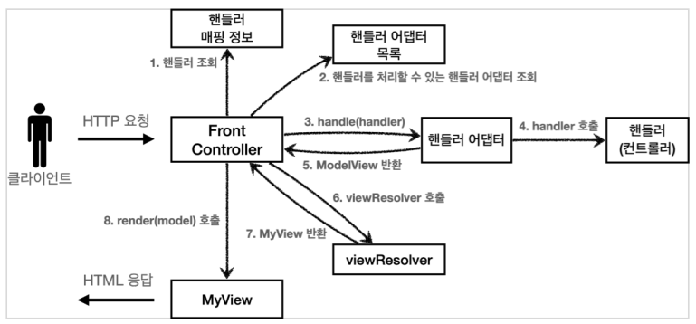
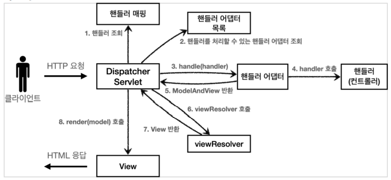
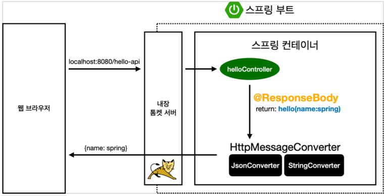
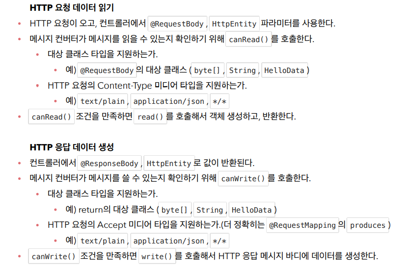
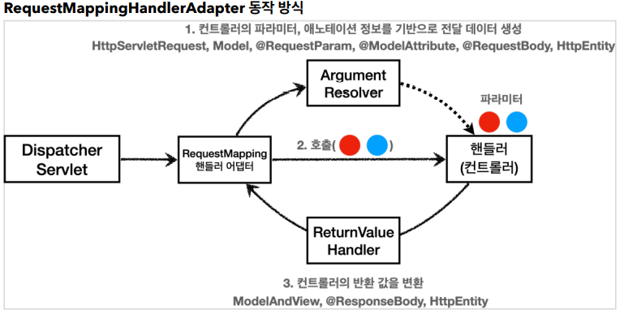
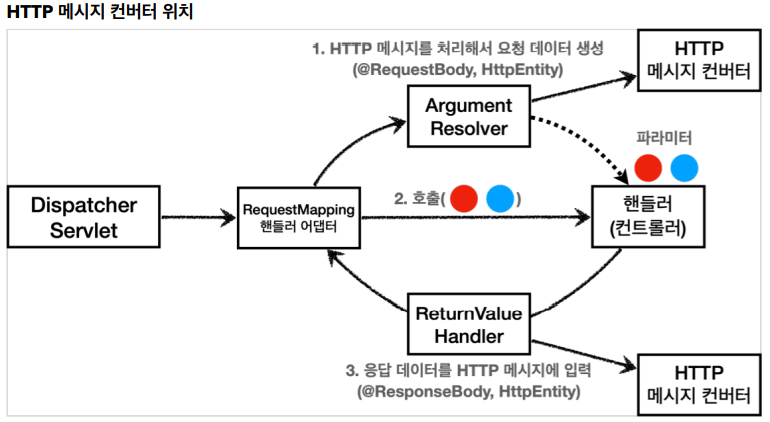

# 스프링 MVC 1편 - Spring MVC

## 스프링 MVC 구조

- 직접 만든 MVC 프레임워크 구조
  - 
- SpringMVC 구조
  - 

#### 직접 만든 프레임워크 스프링 MVC 비교 

- FrontController -> DispatcherServlet 
- handlerMappingMap -> HandlerMapping 
- MyHandlerAdapter -> HandlerAdapter 
- ModelView -> ModelAndView 
- viewResolver -> ViewResolver 
- MyView -> View


## DispatcherServlet

- org.springframework.web.servlet.DispatcherServlet
- 스프링 MVC 도 프론트 컨트롤러 패턴으로 구현되어 있다.
- 스프링 MVC의 프론트 컨트롤러가 바로 디스패처 서블릿이다.
- 디스패쳐 서블릿은 스프링 MVC 의 핵심이다.


- DispatcherServlet 서블릿 등록
  - DispacherServlet 도 부모 클래스에서 HttpServlet 을 상속 받아서 사용하고, 서블릿으로 동작한다.
    - DispatcherServlet > FrameworkServlet > HttpServletBean > HttpServlet
  - 스프링 부트는 DispacherServlet 을 서블릿으로 자동으로 등록하면서 모든 경로( urlPatterns="/" )에 대해서 매핑한다. 
    - 참고: 더 자세한 경로가 우선순위가 높다. 그래서 기존에 등록한 서블릿도 함께 동작한다.


- 요청 흐름
  - 서블릿이 호출되면 HttpServlet 이 제공하는 serivce() 가 호출된다. 
  - 스프링 MVC는 DispatcherServlet 의 부모인 FrameworkServlet 에서 service() 를 오버라이드 해두었다. 
  - FrameworkServlet.service() 를 시작으로 여러 메서드가 호출되면서 DispacherServlet.doDispatch() 가 호출된다.


- DispatcherServlet.doDispatch()

  ```java
  protected void doDispatch(HttpServletRequest request, HttpServletResponse response) throws Exception {
      HttpServletRequest processedRequest = request;
      HandlerExecutionChain mappedHandler = null;
      ModelAndView mv = null;
  
      // 1. 핸들러 조회
      mappedHandler = getHandler(processedRequest);
      if (mappedHandler == null) {
          noHandlerFound(processedRequest, response);
          return;
      }
  
      // 2. 핸들러 어댑터 조회 - 핸들러를 처리할 수 있는 어댑터
      HandlerAdapter ha = getHandlerAdapter(mappedHandler.getHandler());
  
      // 3. 핸들러 어댑터 실행 -> 4. 핸들러 어댑터를 통해 핸들러 실행 -> 5. ModelAndView 반환
      mv = ha.handle(processedRequest, response, mappedHandler.getHandler());
      processDispatchResult(processedRequest, response, mappedHandler, mv,
                            dispatchException);
  }
  
  ```

  ```java
  private void processDispatchResult(HttpServletRequest request, 
                                     HttpServletResponse response, 
                                     HandlerExecutionChain mappedHandler, 
                                     ModelAndView mv, 
                                     Exception exception) throws Exception {
  
      // 뷰 렌더링 호출
      render(mv, request, response);
  }
  ```

  ```java
  protected void render(ModelAndView mv, HttpServletRequest request,
                        HttpServletResponse response) throws Exception {
      View view;
      String viewName = mv.getViewName();
  
      // 6. 뷰 리졸버를 통해서 뷰 찾기, 7. View 반환
      view = resolveViewName(viewName, mv.getModelInternal(), locale, request);
  
      // 8. 뷰 렌더링
      view.render(mv.getModelInternal(), request, response);
  }
  ```

  

#### 동작 순서

1. `핸들러 조회`: 핸들러 매핑을 통해 요청 URL에 매핑된 핸들러(컨트롤러)를 조회한다. 
2. `핸들러 어댑터 조회`: 핸들러를 실행할 수 있는 핸들러 어댑터를 조회한다. 
3. `핸들러 어댑터 실행`: 핸들러 어댑터를 실행한다. 
4. `핸들러 실행`: 핸들러 어댑터가 실제 핸들러를 실행한다. 
5. `ModelAndView 반환`: 핸들러 어댑터는 핸들러가 반환하는 정보를 ModelAndView로 변환해서 반환한다. 

6. `viewResolver 호출`: 뷰 리졸버를 찾고 실행한다. JSP의 경우: InternalResourceViewResolver 가 자동 등록되고, 사용된다. 
7. `View 반환`: 뷰 리졸버는 뷰의 논리 이름을 물리 이름으로 바꾸고, 렌더링 역할을 담당하는 뷰 객체를 반환한다. JSP의 경우 InternalResourceView(JstlView) 를 반환하는데, 내부에 forward() 로직이 있다. 
8. `뷰 렌더링`: 뷰를 통해서 뷰를 렌더링 한다


#### 인터페이스 살펴보기

- 스프링 MVC의 큰 장점은 `DispatcherServlet` 코드의 변경 없이, 원하는 기능을 변경하거나 확장할 수 있다는 점이다.
- 지금까지 설명한 대부분을 확장 가능할 수 있게 인터페이스로 제공한다.
- 이 인터페이스들만 구현해서 `DispatcherServlet` 에 등록하면 본인만의 컨트롤러를 만들 수 있다.


#### 주요 인터페이스 목록

- 핸들러 매핑 : org.springframework.web.servlet.HandlerMapping
- 핸들러 어댑터 :org.springframework.web.servlet.HandlerAdapter
- 뷰 리졸버 : org.springframework.web.servlet.ViewResolver
- 뷰 : org.springframework.web.servlet.View


## Spring MVC 기본기능


### HTTP 응답 - HTTP API, 메시지 바디에 직접 입력

- responseBodyV1 

서블릿을 직접 다룰 때 처럼 HttpServletResponse 객체를 통해서 HTTP 메시지 바디에 직접 ok 응답 메시지를 전달한다. 

response.getWriter().write("ok") 


- responseBodyV2 

ResponseEntity 엔티티는 HttpEntity 를 상속 받았는데, HttpEntity는 HTTP 메시지의 헤더, 바디 정보를 가지고 있다. ResponseEntity 는 여기에 더해서 HTTP 응답 코드를 설정할 수 있다. 

HttpStatus.CREATED 로 변경하면 201 응답이 나가는 것을 확인할 수 있다. 


- responseBodyV3 

@ResponseBody 를 사용하면 view를 사용하지 않고, HTTP 메시지 컨버터를 통해서 HTTP 메시지를 직접 입력할 수 있다. ResponseEntity 도 동일한 방식으로 동작한다. 


- responseBodyJsonV1 

ResponseEntity 를 반환한다. HTTP 메시지 컨버터를 통해서 JSON 형식으로 변환되어서 반환된다. 


- responseBodyJsonV2 

ResponseEntity 는 HTTP 응답 코드를 설정할 수 있는데, @ResponseBody 를 사용하면 이런 것을 설정하기 까다롭다. 

@ResponseStatus(HttpStatus.OK) 애노테이션을 사용하면 응답 코드도 설정할 수 있다. 

물론 애노테이션이기 때문에 응답 코드를 동적으로 변경할 수는 없다. 프로그램 조건에 따라서 동적으로 변경하려면 ResponseEntity 를 사용하면 된다. 


- @RestController 

@Controller 대신에 @RestController 애노테이션을 사용하면, 해당 컨트롤러에 모두 @ResponseBody 가 적용되는 효과가 있다. 따라서 뷰 템플릿을 사용하는 것이 아니라, HTTP 메시지 바디에 직접 데이터를 입력한다. 이름 그대로 Rest API(HTTP API)를 만들 때 사용하는 컨트롤러이다. 


참고로 @ResponseBody 는 클래스 레벨에 두면 전체에 메서드에 적용되는데, @RestController 에노테이션 안에 @ResponseBody 가 적용되어 있다.


## HTTP 메시지 컨버터

- 뷰 템플릿으로 HTML 을 생성해서 응답하는 것이 아니라, HTTP API 처럼 JSON 데이터를 HTTP 메시지 바디에서 직접 읽거나 쓰는 경우 HTTP 메시지 컨버터를 사용하면 편리하다.


### ResponseBody 사용 원리



- @ResponseBody 를 사용
  - HTTP의 BODY에 문자 내용을 직접 반환
  - viewResolver 대신에 HttpMessageConverter가 동작
  - 기본 문자처리 : StringHttpMessageConverter
  - 기본 객체처리 : MappingJackson2HttpMessageConverter
  - byte 처리 등등 기타 여러 HttpMessageConverter 가 기본으로 등록 되어 있다.

> 참고: 응답의 경우 클라이언트의 HTTP Accept 해더와 서버의 컨트롤러 반환 타입 정보 둘을 조합해서 HttpMessageConverter 가 선택된다. 


### HTTP 메시지 컨버터 인터페이스 

org.springframework.http.converter.HttpMessageConverter

```java
package org.springframework.http.converter;

public interface HttpMessageConverter<T> {

    boolean canRead(Class<?> clazz, @Nullable MediaType mediaType);
    boolean canWrite(Class<?> clazz, @Nullable MediaType mediaType);
    
	List<MediaType> getSupportedMediaTypes();
    
	T read(Class<? extends T> clazz, HttpInputMessage inputMessage) 
        throws IOException, HttpMessageNotReadableException;
    
	void write(T t, @Nullable MediaType contentType, HttpOutputMessage outputMessage)
        throws IOException, HttpMessageNotWritableException;
}
```

HTTP 메시지 컨버터는 HTTP요청, HTTP 응답 둘 다 사용된다.

- canRead(), canWrite() : 메시지 컨버터가 해당 클래스, 미디어 타입을 지원하는지 체크
- read(), write() : 메시지 컨버터를 통해서 메시지를 읽고 쓰는 기능


- 메시지컨버터 우선순위
  0. ByteArrayHttpMessageConverter = byte[] 데이터를 처리한다.
  1. StringHttpMessageConverter = 문자로 데이터 처리한다.
  2. MappingJackson2HttpMessageConverter = application/json 데이터 처리한다.


### HTTP 요청 및 응답 순서




### 요청 매핑 헨들러 어뎁터 구조

그렇다면 HTTP 메시지 컨버터는 스프링 MVC 어디쯤에서 사용되는 것일까?


- 애노테이션 기반의 컨트롤러, 그러니까 @RequestMapping 을 처리하는 핸들러 어댑터인 
  RequestMappingHandlerAdapter (요청 매핑 헨들러 어뎁터)에 있다.



- ArgumentResolver
  - 어노테이션 기반의 컨트롤러가 다양한 파라미터를 사용할 수 있는 이유이다.
  - 다양한 파라미터 : HttpServletRequest, Model, @RequestParam, @ModelAttrivute, @RequestBody, HttpEntity
  - 애노테이션 기반 컨트롤러를 처리하는 RequestMappingHandlerAdaptor 는 바로 이 ArgumentResolver 를 호출해서 컨트롤러(핸들러)가 필요로 하는 다양한 파라미터의 값(객체)을 생성한다.  그리고 이렇게 파리미터의 값이 모두 준비되면 컨트롤러를 호출하면서 값을 넘겨준다.

- ReturnValueHandler
  - `HandlerMethodReturnValueHandler` 를 줄여서 `ReturnValueHandle` 라 부른다. 
  - `ArgumentResolver` 와 비슷한데, 이것은 응답 값을 변환하고 처리한다.
  - 컨트롤러에서 String으로 뷰 이름을 반환해도, 동작하는 이유가 바로 ReturnValueHandler 덕분이다


### HTTP 메시지 컨버터



HTTP 메시지 컨버터는 어디쯤 있을까?

 HTTP 메시지 컨버터를 사용하는 @RequestBody 도 컨트롤러가 필요로 하는 파라미터의 값에 사용된다.

 @ResponseBody 의 경우도 컨트롤러의 반환 값을 이용한다.


**요청의 경우** @RequestBody 를 처리하는 ArgumentResolver 가 있고, HttpEntity 를 처리하는 ArgumentResolver 가 있다. 이 ArgumentResolver 들이 HTTP 메시지 컨버터를 사용해서 필요한 객체를 생성하는 것이다. (어떤 종류가 있는지 코드로 살짝 확인해보자) 


**응답의 경우** @ResponseBody 와 HttpEntity 를 처리하는 ReturnValueHandler 가 있다. 그리고 여기에서 HTTP 메시지 컨버터를 호출해서 응답 결과를 만든다. 


스프링 MVC는 @RequestBody @ResponseBody 가 있으면 
RequestResponseBodyMethodProcessor (ArgumentResolver) HttpEntity 가 있으면 
HttpEntityMethodProcessor (ArgumentResolver)를 사용한다.