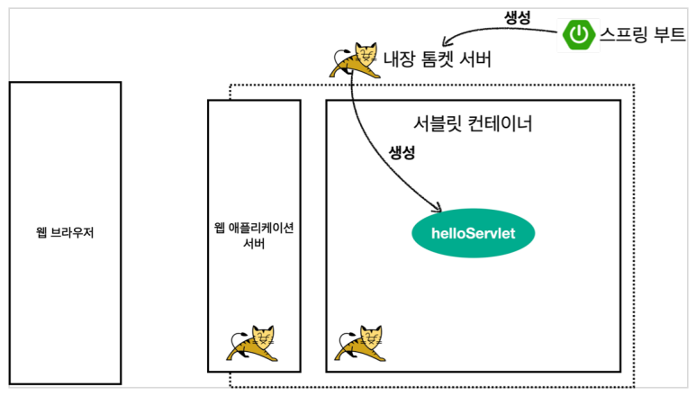
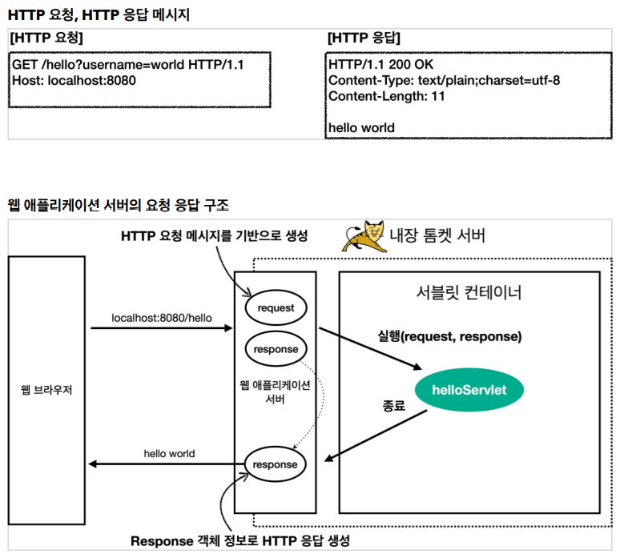

# 스프링 MVC 1편 - 서블릿


## 서블릿

### 스프링 부트 환경에서 서블릿 등록하고 사용하기

> 서블릿은 톰캣 같은 웹 애플리케이션 서버를 직접 설치하고, 그 위에 서블릿 코드를 클래스 파일로 빌드해서 올린 다음, 톰캣 서버를 실행하면 된다.
>
> 하지만 이 과정은 매우 번거롭다. 
>
> 스프링 부트는 톰캣 서버를 내장하고 있으므로, 톰캣 서버 설치 없이 편리하게 서블릿 코드를 실행할 수 있다. 


#### 스프링 부트 서블릿 환경 구성

스프링 부트는 서블릿을 직접 등록해서 사용할 수 있도록 `@ServletComponentScan` 을 지원한다. 

```java
import org.springframework.boot.SpringApplication;
import org.springframework.boot.autoconfigure.SpringBootApplication;
import org.springframework.boot.web.servlet.ServletComponentScan;

@ServletComponentScan // 서블릿 자동 등록
@SpringBootApplication
public class ServletApplication {

    public static void main(String[] args) {
        SpringApplication.run(ServletApplication.class, args);
    }

    /**
     * application.properties 와 동일
     * spring.mvc.view.prefix=/WEB-INF/views/
     * spring.mvc.view.suffix=.jsp
     */
//    @Bean
//    ViewResolver internalResourceViewResolver() {
//        return new InternalResourceViewResolver("/WEB-INF/views/", ".jsp");
//    }

}
```

<br/>

#### 서블릿 동작 코드

```java
import javax.servlet.ServletException;
import javax.servlet.annotation.WebServlet;
import javax.servlet.http.HttpServlet;
import javax.servlet.http.HttpServletRequest;
import javax.servlet.http.HttpServletResponse;
import java.io.IOException;

@WebServlet(name = "helloServlet", urlPatterns = "/hello")
public class HelloServlet extends HttpServlet {
    @Override
    protected void service(HttpServletRequest request, HttpServletResponse response) throws ServletException, IOException {
        System.out.println("HelloServlet.service");
        System.out.println("request = " + request);
        System.out.println("response = " + response);

        String username = request.getParameter("username");
        System.out.println(username);

        response.setContentType("text/plain");
        response.setCharacterEncoding("utf-8");
        response.getWriter().write("hello " + username);
    }
}
```

- @WebServlet : 서블릿 어노테이션
  - name: 서블릿 이름 
  - urlPatterns: URL 매핑

- localhost:8080/hello?username=world 결과: hello world

<br/>

### 서블릿 컨테이너 동작 방식



- 스프링 부트의 내장 톰켓 서버가 서블릿 컨테이너를 읽어 들여서 Bean 등록을 한다.



- 웹 애플리케이션은 HTTP 요청 메세지를 기반으로 request 를 생성하여 서블릿 컨테이너에 전달하고 로직을 거쳐 HTTP 응답을 생성하여 return 한다.


<br/>

### HttpServletRequest

HTTP 요청 메시지를 개발자가 직접 파싱해서 사용해도 되지만, 매우 불편할 것이다. 

서블릿은 개발자가 HTTP 요청 메시지를 편리하게 사용할 수 있도록 개발자 대신에 HTTP 요청 메시지를 파싱한다. 

그리고 그 결과를 `HttpServletRequest` 객체에 담아서 제공한다.


#### HTTP 요청 메시지 

```html
POST /save HTTP/1.1 
Host: localhost:8080 
Content-Type: application/x-www-form-urlencoded 

username=kim&age=20
```

- START LINE 

  - HTTP 메소드 
  - URL 
  - 쿼리 스트링 
  - 스키마, 프로토콜 

- 헤더 

  - 헤더 조회 

- 바디 

  - form 파라미터 형식 조회 
  - message body 데이터 직접 조회 

  

  HttpServletRequest 객체는 추가로 여러가지 부가기능도 함께 제공한다. 

  

  #### 임시 저장소 기능 

- 해당 HTTP 요청이 시작부터 끝날 때 까지 유지되는 임시 저장소 기능 

  - 저장: request.setAttribute(name, value) 

  - 조회: request.getAttribute(name) 

  

  #### 세션 관리 기능 

- request.getSession(create: true)

<br/>

#### HTTP 요청 데이터 - 개요

http 요청 메시지를 통해 클라이언트에서 서버로 데이터를 전달하는 방법 3가지

- GET - 쿼리 파라미터
  - /url?username=hello&age=20 
  - 메시지 바디 없이, URL의 쿼리 파라미터에 데이터를 포함해서 전달 
  - 예) 검색, 필터, 페이징등에서 많이 사용하는 방식
- POST - HTML Form
  - content-type: application/x-www-form-urlencoded 
  - 메시지 바디에 쿼리 파리미터 형식으로 전달 username=hello&age=20 
  - 예) 회원 가입, 상품 주문, HTML Form 사용
- HTTP message body 에 데이터를 직접 담아서 요청
  - HTTP API에서 주로 사용, JSON, XML, TEXT 
- 데이터 형식은 주로 JSON 사용 
  - POST, PUT, PATCH


#### 파라미터 코드

```java
import javax.servlet.ServletException;
import javax.servlet.annotation.WebServlet;
import javax.servlet.http.HttpServlet;
import javax.servlet.http.HttpServletRequest;
import javax.servlet.http.HttpServletResponse;
import java.io.IOException;

/**
 * 1. 파라미터 전송기능
 * http://localhost:8080/request-param?username=hello&age=20
 */
@WebServlet(name = "requestParamServlet", urlPatterns = "/request-param")
public class RequestParamServlet extends HttpServlet {
    @Override
    protected void service(HttpServletRequest request, HttpServletResponse response) throws ServletException, IOException {
        System.out.println("[전체 파리미터 조회] - start");

        request.getParameterNames().asIterator()
                .forEachRemaining(paramName -> System.out.println(paramName + "=" + request.getParameter(paramName)));

        System.out.println("[전체 파리미터 조회] - end");
        System.out.println(
        );

        System.out.println("[단일 파라미터 조회]");
        String username = request.getParameter("username");
        String age = request.getParameter("age");
        System.out.println("username = " + username);
        System.out.println("age = " + age);
        System.out.println();

        System.out.println("[이름이 같은 복수 파라미터 조회]");
        String[] usernames = request.getParameterValues("username");
        for (String name : usernames) {
            System.out.println("username = " + name);
        }

        response.getWriter().write("ok");
    }
}
```


<br/>

#### 헤더 코드

```java
import javax.servlet.ServletException;
import javax.servlet.annotation.WebServlet;
import javax.servlet.http.Cookie;
import javax.servlet.http.HttpServlet;
import javax.servlet.http.HttpServletRequest;
import javax.servlet.http.HttpServletResponse;
import java.io.IOException;
import java.util.Enumeration;

@WebServlet(name = "requestHeaderServerlet", urlPatterns = "/request-header")
public class RequestHeaderServlet extends HttpServlet {
    @Override
    protected void service(HttpServletRequest request, HttpServletResponse response) throws ServletException, IOException {

        printStartLine(request);
        printHeaders(request);
        printHeaderUtils(request);
        printEtc(request);
    }

    private void printStartLine(HttpServletRequest request) {
        System.out.println("--- REQUEST-LINE - start ---");
        System.out.println("request.getMethod() = " + request.getMethod()); //GET
        System.out.println("request.getProtocal() = " + request.getProtocol()); // HTTP/1.1
        System.out.println("request.getScheme() = " + request.getScheme()); //http
        // http://localhost:8080/request-header
        System.out.println("request.getRequestURL() = " + request.getRequestURL());
        // /request-test
        System.out.println("request.getRequestURI() = " + request.getRequestURI());
        //username=hi
        System.out.println("request.getQueryString() = " +
                request.getQueryString());
        System.out.println("request.isSecure() = " + request.isSecure()); //https 사용 유무
        System.out.println("--- REQUEST-LINE - end ---");
        System.out.println();
    }

    private void printHeaders(HttpServletRequest request) {
        System.out.println("--- Headers - start ---");

        // 옛날방식 header 가져오는 방법
        Enumeration<String> headerNames = request.getHeaderNames();
//        while (headerNames.hasMoreElements()) {
//            String headerName = headerNames.nextElement();
//            System.out.println(headerName);
//        }


        request.getHeaderNames().asIterator()
                .forEachRemaining(System.out::println);

        System.out.println("--- Headers - start ---");
    }

    //Header 편리한 조회
    private void printHeaderUtils(HttpServletRequest request) {
        System.out.println("--- Header 편의 조회 start ---");
        System.out.println("[Host 편의 조회]");
        System.out.println("request.getServerName() = " +
                request.getServerName()); //Host 헤더
        System.out.println("request.getServerPort() = " +
                request.getServerPort()); //Host 헤더
        System.out.println();
        System.out.println("[Accept-Language 편의 조회]");
        request.getLocales().asIterator()
                .forEachRemaining(locale -> System.out.println("locale = " +
                        locale));
        System.out.println("request.getLocale() = " + request.getLocale());
        System.out.println();
        System.out.println("[cookie 편의 조회]");
        if (request.getCookies() != null) {
            for (Cookie cookie : request.getCookies()) {
                System.out.println(cookie.getName() + ": " + cookie.getValue());
            }
        }
        System.out.println();
        System.out.println("[Content 편의 조회]");
        System.out.println("request.getContentType() = " +
                request.getContentType());
        System.out.println("request.getContentLength() = " +
                request.getContentLength());
        System.out.println("request.getCharacterEncoding() = " +
                request.getCharacterEncoding());
        System.out.println("--- Header 편의 조회 end ---");
        System.out.println();
    }


    //기타 정보
    private void printEtc(HttpServletRequest request) {
        System.out.println("--- 기타 조회 start ---");
        System.out.println("[Remote 정보]"); // 요청 정보
        System.out.println("request.getRemoteHost() = " +
                request.getRemoteHost()); //
        System.out.println("request.getRemoteAddr() = " +
                request.getRemoteAddr()); //
        System.out.println("request.getRemotePort() = " +
                request.getRemotePort()); //
        System.out.println();
        System.out.println("[Local 정보]"); // 서버의 정보
        System.out.println("request.getLocalName() = " +
                request.getLocalName()); //
        System.out.println("request.getLocalAddr() = " +
                request.getLocalAddr()); //
        System.out.println("request.getLocalPort() = " +
                request.getLocalPort()); //
        System.out.println("--- 기타 조회 end ---");
        System.out.println();
    }
}

```

<br/>

#### 메시지 바디 텍스트

``` java
import org.springframework.util.StreamUtils;

import javax.servlet.ServletException;
import javax.servlet.ServletInputStream;
import javax.servlet.annotation.WebServlet;
import javax.servlet.http.HttpServlet;
import javax.servlet.http.HttpServletRequest;
import javax.servlet.http.HttpServletResponse;
import java.io.IOException;
import java.nio.charset.StandardCharsets;

@WebServlet(name = "requestBodyStringServlet", urlPatterns = "/request-body-string")
public class RequestBodyStringServlet extends HttpServlet {
    @Override
    protected void service(HttpServletRequest request, HttpServletResponse response) throws ServletException, IOException {
        ServletInputStream inputStream = request.getInputStream();
        String messageBody = StreamUtils.copyToString(inputStream, StandardCharsets.UTF_8);
        System.out.println("messageBody = " + messageBody);
        response.getWriter().write("ok");
    }
}

```

<br/>

```java
import com.fasterxml.jackson.databind.ObjectMapper;
import hello.servlet.basic.HelloData;
import org.springframework.util.StreamUtils;

import javax.servlet.ServletException;
import javax.servlet.ServletInputStream;
import javax.servlet.annotation.WebServlet;
import javax.servlet.http.HttpServlet;
import javax.servlet.http.HttpServletRequest;
import javax.servlet.http.HttpServletResponse;
import java.io.IOException;
import java.nio.charset.StandardCharsets;

@WebServlet(name = "requestBodyJsonServlet", urlPatterns = "/request-body-json")
public class RequestBodyJsonServlet extends HttpServlet {

    private final ObjectMapper objectMapper = new ObjectMapper();

    @Override
    protected void service(HttpServletRequest request, HttpServletResponse response) throws ServletException, IOException {
        ServletInputStream inputStream = request.getInputStream();
        String messageBody = StreamUtils.copyToString(inputStream, StandardCharsets.UTF_8);
        System.out.println("messageBody = " + messageBody);

        HelloData helloData = objectMapper.readValue(messageBody, HelloData.class);

        System.out.println("helloData.username = " + helloData.getUsername());
        System.out.println("helloData.age = " + helloData.getAge());

        response.getWriter().write("ok");
    }
}
```


<br/><br/>

### HttpServletRequest

- 응답 유형


#### Html Servlet

```java
import javax.servlet.ServletException;
import javax.servlet.annotation.WebServlet;
import javax.servlet.http.HttpServlet;
import javax.servlet.http.HttpServletRequest;
import javax.servlet.http.HttpServletResponse;
import java.io.IOException;
import java.io.PrintWriter;

@WebServlet(name = "responseHtmlServlet", urlPatterns = "/response-html")
public class ResponseHtmlServlet extends HttpServlet {
    @Override
    protected void service(HttpServletRequest request, HttpServletResponse response) throws ServletException, IOException {
        // Content-Type: text/html;charset=utf-8
        response.setContentType("text/html");
        response.setCharacterEncoding("utf-8");

        PrintWriter writer = response.getWriter();
        writer.println("<html>");
        writer.println("    <body>");
        writer.println("        <div>안녕?</div>");
        writer.println("    </body>");
        writer.println("</html>");
    }
}

```

<br/>

#### Header

```java
import javax.servlet.ServletException;
import javax.servlet.annotation.WebServlet;
import javax.servlet.http.Cookie;
import javax.servlet.http.HttpServlet;
import javax.servlet.http.HttpServletRequest;
import javax.servlet.http.HttpServletResponse;
import java.io.IOException;
import java.io.PrintWriter;

@WebServlet(name = "responseHeaderServlet", urlPatterns = "/response-header")
public class ResponseHeaderServlet extends HttpServlet {
    @Override
    protected void service(HttpServletRequest request, HttpServletResponse response) throws ServletException, IOException {
        // [status-line]
        response.setStatus(HttpServletResponse.SC_OK);

        // [response-headers]
//        response.setHeader("Content-Type", "text/plain;charset=utf-8");
        response.setHeader("Cache-Control", "no-cache, no-store, must-revalidate");
        response.setHeader("Pragma", "no-cache");
        response.setHeader("my-header", "hello");

        //[header 편의 메소드]
        content(response);
        cookie(response);
        redirect(response);

        //[message body]
        PrintWriter writer = response.getWriter();
        writer.println("ok");
    }

    private void content(HttpServletResponse response) {
        //Content-Type: text/plain;charset=utf-8
        //Content-Length: 2
        //response.setHeader("Content-Type", "text/plain;charset=utf-8");
        response.setContentType("text/plain");
        response.setCharacterEncoding("utf-8");
        //response.setContentLength(2); //(생략시 자동 생성)
    }

    private void cookie(HttpServletResponse response) {
        //Set-Cookie: myCookie=good; Max-Age=600;
        //response.setHeader("Set-Cookie", "myCookie=good; Max-Age=600");
        Cookie cookie = new Cookie("myCookie", "good");
        cookie.setMaxAge(600); //600초
        response.addCookie(cookie);
    }

    private void redirect(HttpServletResponse response) throws IOException {
        //Status Code 302
        //Location: /basic/hello-form.html
        //response.setStatus(HttpServletResponse.SC_FOUND); //302
        //response.setHeader("Location", "/basic/hello-form.html");
        response.sendRedirect("/basic/hello-form.html");
    }
}
```

<br/>

#### Json

```java
import com.fasterxml.jackson.databind.ObjectMapper;
import hello.servlet.basic.HelloData;

import javax.servlet.ServletException;
import javax.servlet.annotation.WebServlet;
import javax.servlet.http.HttpServlet;
import javax.servlet.http.HttpServletRequest;
import javax.servlet.http.HttpServletResponse;
import java.io.IOException;

@WebServlet(name = "responseJsonServlet", urlPatterns = "/response-json")
public class ResponseJsonServlet extends HttpServlet {

    private final ObjectMapper objectMapper = new ObjectMapper();

    @Override
    protected void service(HttpServletRequest request, HttpServletResponse response) throws ServletException, IOException {
        //Content-Type: application/json
        response.setContentType("application/json");
        response.setCharacterEncoding("utf-8");

        HelloData helloData = new HelloData();
        helloData.setUsername("kim");
        helloData.setAge(20);

        //{"username":"kim","age":20}
        String result = objectMapper.writeValueAsString(helloData);
        response.getWriter().write(result);
    }
}

```

