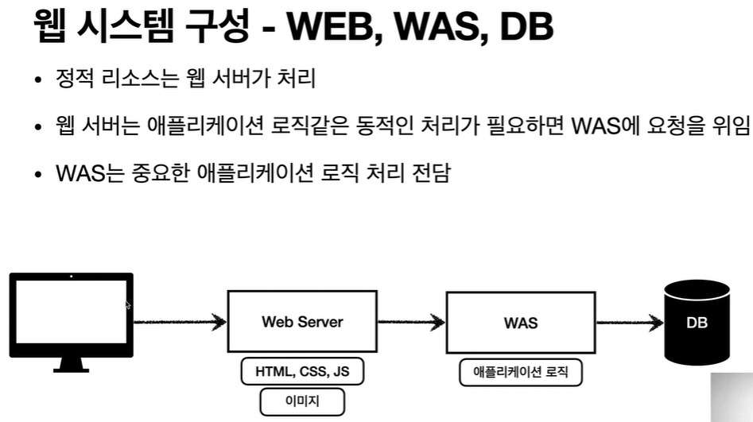

# 웹 서버, 웹 애플리케이션 서버

## 웹 - HTTP 기반

모든 인터넷 상에서는 http 기반으로 데이터를 주고 받는다.

### HTTP 메시지에 모든 것을 전송

- HTML, TEXT
- IMAGE, 음성, 영상, 파일
- JOSN, XML (API)
- 거의 모든 형태의 데이터 전송 가능
- 서버간에 데이터를 주고 받을 때도 대부분 HTTP 사용

### 웹서버

- HTTP 기반으로 동작
- 정적 리소스제공, 기타 부가기능
- 정적(파일) HTML, CSS, JS, 이미지, 영상
- 예) NGINX, APACHE

### 웹 애플리케이션 서버(WAS - Web Application Server)

프로그래밍을 할 수 있다.

- HTTP 기반으로 동작
- 웹서버 기능포함
- 프로그램 코드를 실행해서 애플리케이션 로직 수행
  - 동작 HTML, HTTP API (JSON)
  - 서블릿, JSP, 스프링 MVC
- 예) 톰캣, Jetty, Undertow

### 차이 

- 웹서버 - 정적리소스, was 애플리케이션 로직
- 사실 둘의 용어 경계도 모호함
- 자바는 서블릿 컨테이너 기능을 제공하면 was
  - 서블릿 없이 자바코드를 실행하는 서버 프레임워크도 있음
- was 는 애플리케이션 코드를 실행하는데 더 특화

### 기본 웹시스템 구성

### 보편적인 웹시스템 구성

